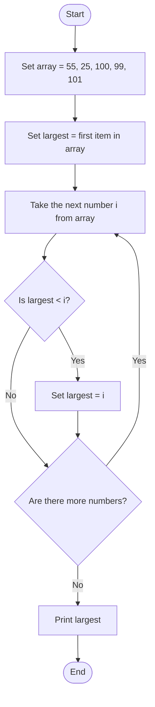

# Largest Number Flowchart

```mermaid
flowchart TD
    A([Start]) --> B[Set array = 55, 25, 100, 99, 101]
    B --> C[Set largest = first item in array]
    C --> D[Take the next number i from array]
    D --> E{Is largest < i?}
    E -- Yes --> F[Set largest = i]
    E -- No --> G{Are there more numbers?}
    F --> G
    G -- Yes --> D
    G -- No --> H[Print largest]
    H --> I([End])
```
